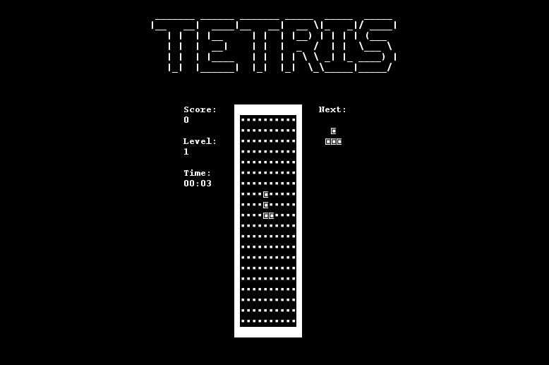
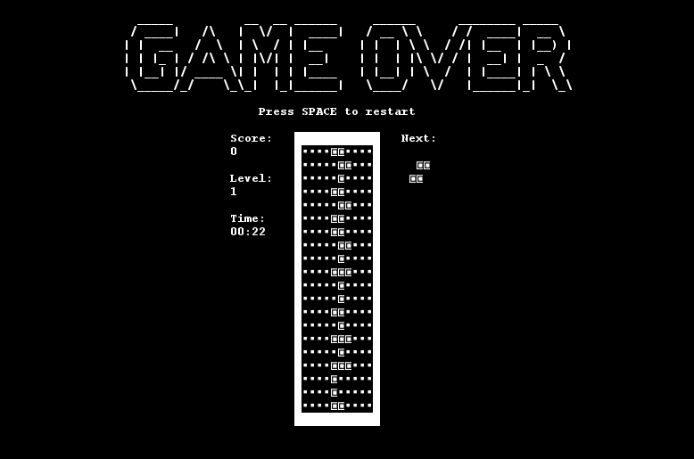

# Tetris Lanterna

## 1. Wprowadzenie
Projekt **Tetris** to implementacja klasycznej gry Tetris w języku Java, oparta na architekturze Model-View-Controller (MVC). Wykorzystuje bibliotekę **Lanterna** do renderowania w trybie tekstowym. Projekt obejmuje:
- Obsługę klawiatury (ruchy i obracanie klocków).
- Zliczanie punktów i poziomów.
- Mechanikę generowania i usuwania pełnych linii.

---

## 2. Struktura projektu

### 2.1. Główne klasy:
- **Tetris**: Punkt startowy aplikacji. Inicjalizuje i uruchamia grę.
- **Model**: Reprezentuje logikę gry, zarządzanie planszą i statusem gry.
- **View**: Odpowiada za wyświetlanie stanu gry na ekranie terminala.
- **Controller**: Obsługuje wejścia użytkownika i koordynuje działania między modelem a widokiem.

### 2.2. Testy jednostkowe:
- **ControllerTest**: Testuje obsługę klawiatury i interakcje kontrolera.
- **ModelTest**: Weryfikuje logikę gry (ruchy, obroty, usuwanie linii).
- **ViewTest**: Sprawdza poprawność renderowania widoku.
- **TetrisTest**: Testuje poprawność inicjalizacji gry.

---

## 3. Szczegóły implementacji

### 3.1. Klasa `Model` (Logika gry)
**Lokalizacja**: `Model.java`  
**Opis**: Zarządza logiką gry i stanem planszy.

- **Pola:**
  - `board` - Dwuwymiarowa tablica reprezentująca planszę gry.
  - `currentPiece` - Aktualny klocek.
  - `nextPiece` - Następny klocek.
  - `score`, `level`, `linesCleared` - Statystyki gry.
  - `GameOver`, `MessageGameOver` - Flagi stanu gry.

- **Najważniejsze metody:**
  - `resetGame()` - Resetuje grę do stanu początkowego.
  - `Down()`, `Left()`, `Right()` - Odpowiadają za ruchy klocków.
  - `rotate()` - Obraca aktualny klocek.
  - `ClearLines()` - Usuwa pełne linie z planszy.
  - `SpawnPiece()` - Generuje nowy klocek.

---

### 3.2. Klasa `View` (Widok gry)
**Lokalizacja**: `View.java`  
**Opis**: Renderuje aktualny stan gry na ekranie terminala.

- **Pola:**
  - `screen` - Obiekt Lanterna do zarządzania ekranem.

- **Najważniejsze metody:**
  - `Board(Model model)` - Wyświetla planszę gry, aktualny klocek, kolejny klocek oraz statystyki.
  - Wyświetla komunikat "GAME OVER" w razie zakończenia gry.

---

### 3.3. Klasa `Controller` (Kontroler)
**Lokalizacja**: `Controller.java`  
**Opis**: Odpowiada za obsługę wejścia użytkownika i synchronizację modelu z widokiem.

- **Pola:**
  - `model` - Obiekt logiki gry.
  - `view` - Obiekt widoku gry.

- **Najważniejsze metody:**
  - `InputKey(KeyStroke keyStroke)` - Obsługuje klawisze strzałek i spacji.
  - `updateView()` - Aktualizuje widok na podstawie modelu.

---

### 3.4. Klasa `Tetris` (Główna klasa)
**Lokalizacja**: `Tetris.java`  
**Opis**: Punkt startowy aplikacji.

- **Działanie:**
  - Inicjalizuje obiekty `Model`, `View` i `Controller`.
  - Tworzy pętlę gry obsługującą wejścia użytkownika i odświeżanie widoku.

---

## 4. Testy jednostkowe
Projekt zawiera testy jednostkowe napisane w JUnit 5:

- **ControllerTest.java**
  - Testuje reakcje na klawisze (`Left`, `Right`, `Down`, `rotate`).
  - Weryfikuje poprawność restartu gry po zakończeniu.

- **ModelTest.java**
  - Testuje logikę ruchów, obrotów i usuwania linii.
  - Sprawdza poprawność generowania i umieszczania klocków.

- **ViewTest.java**
  - Weryfikuje poprawność wyświetlania planszy.
  - Sprawdza poprawność renderowania komunikatu "GAME OVER".

- **TetrisTest.java**
  - Testuje poprawność inicjalizacji aplikacji.

---

## 5. Zrzuty ekranu z gry




---

## 6. Uruchamianie gry

### 6.1. Wymagania:
- **JDK**: Wersja 21 lub nowsza.
- **Zależności**: Lanterna, JUnit.

### 6.2. Kroki:
Sklonuj repozytorium:
   ```bash
   git clone https://github.com/Akineyshen/TetrisLanterna
